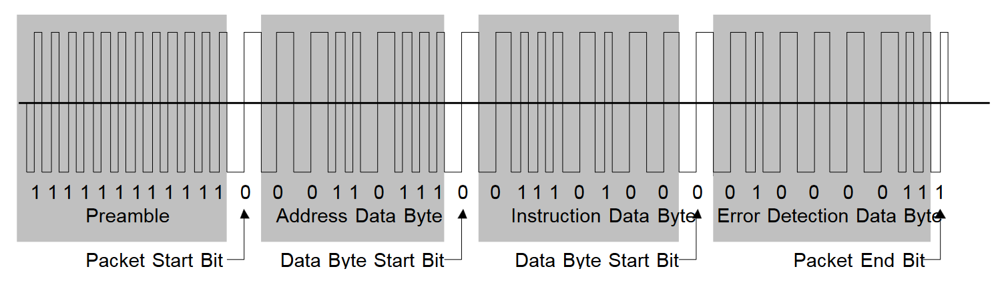

# S-9.2 DCC Communications Standards {#dcc-communications-standard}

[Original](https://www.nmra.org/sites/default/files/s-92-2004-07.pdf)

Original Version: July 2004

This standard covers the format of the information sent via Digital Command Stations to Digital Decoders. A Digital Command Station transmits this information to Digital Decoders by sending a series of bits using the NMRA digital signal described in S-9.1. This sequence of bits, termed a packet, is used to encode one of a set of instructions that the Digital Decoder operates upon. Packets must be precisely defined to ensure that the intended instructions can be properly encoded and decoded.

## A: General Packet Format {#general-packet-format}

The following sequence of bits defines a valid NMRA packet. Any sequence of bits not meeting the full specifications of this general packet format is not, for the purpose of this standard, a “packet”. Digital decoders should not act on any instructions that are not contained within a valid packet while in the NMRA digital mode of operation[^1].

- **Preamble**
    - The preamble to a packet consists of a sequence of `1` bits. A digital decoder must not accept as a valid, any preamble that has less than 10 complete `1` bits, or require for proper reception of a packet with more than 12 complete `1` bits. A command station must send a minimum of 14 full preamble bits.
- **Packet Start Bit**
    - The packet start bit is the first bit with a value of `0` that follows a valid preamble. The Packet Start Bit terminates the preamble and indicates that the next bits are an address data byte.
- **Address Data Byte**
    - The first data byte of the packet normally contains eight bits of address information[^2]. The first transmitted address bit shall be defined to be the most significant bit of the address data byte. Address Data Bytes with values `00000000`, `11111110`, and `11111111` are reserved for special operations and must not be transmitted except as provided in this Standard or associated Recommended Practices.
- These must occur one or more times
    - **Data Byte Start Bit**
        - This bit precedes a data byte and has the value of `0`.
    - **Data Byte**
        - Each data byte contains eight bits of information used for address, instruction, data, or error detection purposes. The first transmitted data bit of each data byte shall be defined to be the most significant bit of the data byte.
- **Packet End Bit**
    - This bit marks the termination of the packet and has a value of `1`[^3].

Figure 1 provides an example of an acceptable command control packet that uses three data bytes: one address data byte, one instruction data byte and one error detection data byte.

<figure>

<figcaption>Figure 1: Example of a Transmitted Packet</figcaption>
</figure>

## B: Baseline Packets {#baseline-packets}

The Baseline Packets are included to provide the minimum interoperability between different systems. More complex packet formats that support different types of decoders, additional functions, addresses and speeds are provided in the Extended Packet Format Recommended Practice (RP-9.2.1). It is the intention of this Standard that, in order to conform: a Command Station must encode operator control input in conformance with the Baseline Packet semantics; and a Digital Decoder must recognize and provide suitable locomotive control electrical output in conformance with the Baseline Packet semantics. Digital Decoder Idle Packets and Digital Decoder Broadcast Stop Packets[^4] (defined below) are optional for Command Stations, and required for decoders.

### Speed and Direction Packet For Locomotive Decoders {#speed-and-direction-packet-for-locomotive-decoders}

```
111111111111 0 0AAAAAAA 0 01DCSSSS 0 EEEEEEEE 1
Preamble       Byte One   Byte Two   Byte Three (Error Detection Data Byte)
```

- Byte One: Address Data Byte `0AAAAAAA`
    - The address data byte contains the address of the intended recipient of the packet. Every Digital Decoder shall be capable of retaining and recognizing its own address for purposes of responding to Baseline Packets. Locomotive Digital Decoders shall support the full range of baseline addresses in such a manner that this address is easily configurable by the user[^5]. It is acceptable for Digital Command Stations to restrict the number of valid addresses supported so long as this restriction is clearly and plainly labeled on the package and in the instructions.
- Byte Two: Instruction Data Byte `01DCSSSS`
    - The instruction data byte is a data byte used to transmit speed and direction information to the locomotive Digital Decoder. Bits 0-3[^6] provides 4 bits for speed (`S`) with bit 0 being the least significant speed bit. Bit four of byte 2 (`C`) by default shall contain one additional speed bit, which is the least significant speed bit. For backward compatibility, this bit may instead be used to control the headlight. This optional use is defined in RP-9.2.1. Bit 5 provides one bit for direction (`D`). When the direction bit (`D`) has a value of `1` the locomotive should move in the forward direction[^7]. A direction bit with the value of `0` should cause the locomotive to go in the reverse direction. Bits 7 and 6 contain the bit sequence `01`[^8] which are used to indicate that this instruction data byte is for speed and direction.
- Byte Three: Error Detection Data Byte `EEEEEEEE`
    - The error detection data byte is a data byte used to detect the presence of transmission errors. The contents of the Error Detection Data Byte shall be the bitwise exclusive OR of the contents of the Address Data Byte and the Instruction Data Byte in the packet concerned. (e.g. the exclusive OR of bit 0 of the address data byte and bit 0 of the instruction data byte will be placed in bit 0 of the error detection data byte...) Digital Decoders receiving a Baseline Packet shall compare the received error detection data byte with the bitwise exclusive OR of the received address and instruction data bytes and ignore the contents of the packet if this comparison is not identical.

The example packet shown in figure 2 illustrates a baseline packet with the instruction to locomotive 55 to proceed in the forward direction at speed step 6.

`CSSSS` | Speed
:---:|:---:
`00000` | Stop
`10000` | Stop[^I]
`00001` | E-Stop[^*]
`10001` | E-Stop[^*][^I]
`00010` | Step 1
`10010` | Step 2
`00011` | Step 3
`10011` | Step 4
&vellip; | &vellip;
`01111` | Step 27
`11111` | Step 28

[^*]: Digital Decoders shall immediately stop delivering power to the motor.

[^I]: Direction bit may be ignored for directional sensitive functions. (Optional)

<figure>
<figcaption>Figure 2: Speed Table for Baseline Packet</figcaption>
</figure>

### Digital Decoder Reset Packet For All Decoders {#digital-decoder-reset-packet-for-all-decoders}

```
111111111111 0 00000000 0 00000000 0 00000000 1
Preamble       Byte One   Byte Two   Byte Three (Error Detection Data Byte)
```

A three byte packet, where all eight bits within each of the three bytes contains the value of `0`, is defined as a Digital Decoder Reset Packet. When a Digital Decoder receives a Digital Decoder Reset Packet, it shall erase all volatile memory (including any speed and direction data), and return to its normal power-up state. If the Digital Decoder is operating a locomotive at a non-zero speed when it receives a Digital Decoder Reset, it shall bring the locomotive to an immediate stop.

Following a Digital Decoder Reset Packet, a Command Station shall not send any packets with an address data byte between the range `01100100` and `01111111` inclusive within 20 milliseconds, unless it is the intent to enter service mode[^9].

### Digital Decoder Idle Packet For All Decoders {#digital-decoder-idle-packet-for-all-decoders}

```
111111111111 0 11111111 0 00000000 0 11111111 1
Preamble       Byte One   Byte Two   Byte Three (Error Detection Data Byte)
```

A three byte packet, whose first byte contains eight `1`s, whose second byte contains eight `0`s and whose third and final byte contains eight `1`s, is defined as a Digital Decoder Idle Packet. Upon receiving this packet, Digital Decoders shall perform no new action, but shall act upon this packet as if it were a normal digital packet addressed to some other decoder.

### Digital Decoder Broadcast Stop Packets For All Decoders[^10] {#digital-decoder-broadcast-stop-packets-for-all-decoders}

```
111111111111 0 00000000 0 01DC000S 0 EEEEEEEE 1
Preamble       Byte One   Byte Two   Byte Three (Error Detection Data Byte)
```

A three byte packet, whose first byte contains eight `0`s, whose second byte contains a specific stop command and whose third and final byte contains an error byte that is identical to the second byte of the packet, is defined as a Digital Decoder Broadcast Stop Packet. Upon receiving this packet where bit zero of byte two (`S`) contains a value of `0`, digital decoders intended to control a locomotive's motor shall bring the locomotive to a stop.

Upon receiving this packet where bit zero of byte two (`S`) contains a value of `1`, digital decoders intended to control a locomotive's motor shall stop delivering energy to the motor. If bit four of byte 2 (`C`) contains a value of `1`, the direction bit contained in bit five of byte 2 (`D`) may optionally be ignored for all direction sensitive functions.

## C: Frequency Of Packet Transmission {#frequency-of-packet-transmission}

Packets sent to Digital Decoders should be repeated as frequently as possible, as a packet may have been lost due to noise or poor electrical conductivity between wheels and rails. Power may also be removed from the rails between the Packet End Bit and the Preamble of the next packet to allow for alternative command control formats. A Digital Decoder shall be able to act upon multiple packets addressed to it, provided the time between the packet end bit of the first packet and the packet start bit of the second packet are separated by at least 5 milliseconds[^11]. If a decoder receives a bit sequence with a missing or invalid data byte start bit, a missing or invalid packet end bit, or an incorrect error detection byte, it must recognize the next valid preamble sequence as the beginning of a new packet. Alternative command control formats are specifically allowed between the packet end bit and the start of the next preamble.

Manufacturers of decoders are encouraged to provide automatic conversion for a variety of power signals and
command control formats in addition to the NMRA digital signal (per S-9.1), provided that automatic conversion to these alternate power signals can be disabled. If automatic conversion is enabled, Digital Decoders must remain in digital mode and not convert to using any alternate power signal so long as the time between Packet Start Bits is less than or equal to 30 milliseconds in duration. If automatic conversion is disabled, Digital Decoders must remain in digital mode regardless of the timing of Packet Start Bits. It shall be possible to configure Digital Command Stations to transmit at least one complete packet every 30 milliseconds as measured from the time between packet start bits[^12] [^13].

[^1]: It is permissible for *Digital Decoders* to accept formats in addition to the NMRA General Packet Format. See Section C for details.

[^2]: The first byte can also be used in special cases to indicate instructions. See the Service Mode Recommended Practice (RP-9.2.3) for an example of this dual use.

[^3]: The Packet End Bit may count as one of the preamble bits of the subsequent packet if there are no inter-packet bits from an alternative command control protocol. The DCC bit stream must continue for an additional 26 µS (minimum) after the packet end bit.

[^4]: Broadcast Stop Packet requirement for decoders, effective 1-Aug-2002.

[^5]: The Service Mode Recommended Practice (RP-9.2.3) contains one example of an acceptable method for user address configuration.

[^6]: Bits within a byte are numbered right to left with bit 0 (the right most bit) being the least significant bit and bit 7 (the left most bit) being the most significant bit.

[^7]: Forward in this case is in the direction of the front of the locomotive, as observed from the engineer's position within the locomotive.

[^8]: Other bit patterns in bits 7 and 6 are reserved for other types of instruction data, and are defined in the Extended Packet Format Recommended Practice (RP-9.2.1).

[^9]: Digital Decoders can have their configurations altered immediately after a digital decoder reset packet. See the Service Mode Recommended Practice (RP-9.2.3) for details.

[^10]: Broadcast Stop Packet requirement for decoders, effective 1-Aug-2002.

[^11]: Care must be taken to ensure that two packets with identical addresses are not are not transmitted within 5 milliseconds of each other for addresses in the range between 112-127 as older decoders may interpret these packets as service mode packets (see RP-9.2.3).

[^12]: Some DCC decoders manufactured prior to the NMRA standards require a valid baseline packet be received every 30 milliseconds to prevent analog power conversion.

[^13]: Longer repetition rates may result in less than optimal decoder performance.
